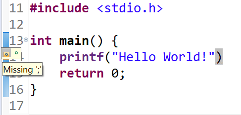
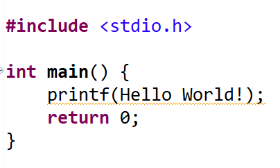
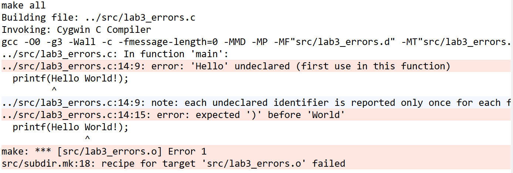
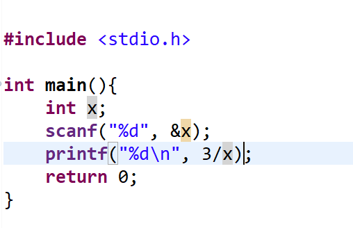
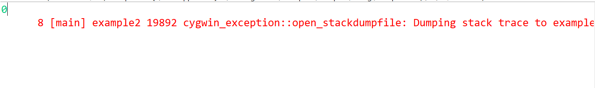
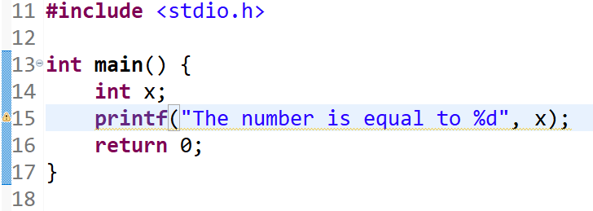
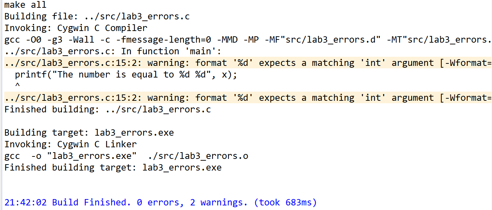

# Cmpe150.04 Week 2

## Summary of Last Week

### Output

```c 
#include <stdio.h>
int main()
{
    printf("Hello world!");
	return 0;    
}
```

### Integer variables

```c 
#include <stdio.h>
int main()
{
    int number_1, number_2, sum;
    scanf("%d", &number_1);
    scanf("%d", &number_2);
    sum = number_1 + number_2;
    printf("Number1: %d Number2: %d Sum: %d \n", number_1, number_2, sum);
	return 0;    
}
```

------

### Variable names

* It can contain alphanumeric characters and underscore(_)

  * ```c
    int number;
    int car_type;
    int week2_notes;
    ```

* It cannot start with number.

* Case-sensitive.

  * ```c
    #include <stdio.h>
    int main(){
        int x = 2;
        int X = 4;
        printf("%d\n", x);
        printf("%d\n", X);
        return 0;
    }
    ```

###  Warm Up

Write a program that prints the following shape to the screen using only *printf()*.

```
*   *  
 * *   
  *    
 * *   
*   *  
```

or 

Write a  program that prints a block F using hash (#), where the F has a height of six characters and width of five and four characters.

```
######
#
#
#####
#
#
#
```

### Warm Up

Write a program that takes two integers from the user and then prints the product of the numbers.

```
input: 3 4 
output: 12

input: 5 8 
output: 40
```

### Bit vs Byte

* **Bit:** the smallest unit, *0 or 1*.
* **Byte:** a collection of bits: *8 bits.* *(i.e. 01010111)* 

### Fundamental Data Types


| Type                     | Size (bytes)                  | Format Specifier |
| :----------------------- | :---------------------------- | :--------------: |
| `int`                    | at least 2, usually 4         |       `%d`       |
| `char`                   | 1                             |       `%c`       |
| `float`                  | 4                             |       `%f`       |
| `double`                 | 8                             |      `%lf`       |
| `short int`              | 2 usually                     |      `%hd`       |
| `unsigned int`           | at least 2, usually 4         |       `%u`       |
| `long int`               | at least 4, usually 8         |      `%li`       |
| `long long int`          | at least 8                    |      `%lli`      |
| `unsigned long int`      | at least 4                    |      `%lu`       |
| `unsigned long long int` | at least 8                    |      `%llu`      |
| `signed char`            | 1                             |       `%c`       |
| `unsigned char`          | 1                             |       `%c`       |
| `long double`            | at least 10, usually 12 or 16 |      `%Lf`       |

### Integer Representation

* If an integer type is stored in N bits
  * Signed range: -2^(N-1) and 2^(N-1) -1
  * Unsigned range: 0 to 2^N - 1.
  * Example: int: 4 bytes = 32 bits
    * int: - 2^(31) and 2^(31) -1.
    * unsigned int: 0 and 2^(32) - 1.
* The sizeof() function returns the number of bytes occupied by each type. Returns *long*, so the identifier: *%lu*

#### Overflow: Outside of the range.

```c 
#include <stdio.h>
int main()
{
    // the sizes of data types
    printf("size of char = %lu\n", sizeof(int));
    printf("size of char = %lu\n", sizeof(long));
    printf("size of char = %lu\n", sizeof(unsigned int));
    int a; // declaration
    a = 2147483647; // assignment of largest int
    printf("%d\n", a+1);
    return 0;
}
```

### Floating Point Representation

Stores nonintegers. 

|    Type     | Storage size |      Value range       |     Precision     |
| :---------: | :----------: | :--------------------: | :---------------: |
|    float    |    4 byte    |   1.2E-38 to 3.4E+38   | 6 decimal places  |
|   double    |    8 byte    |  2.3E-308 to 1.7E+308  | 15 decimal places |
| long double |   10 byte    | 3.4E-4932 to 1.1E+4932 | 19 decimal places |

### Q1

Write a C program that reads the radius of a sphere and calculates the volume. *(π: 3.14)*
$$
V = 4/3*π*r^3
$$

```
input: 3.5
output: 179.50
```

### Q2

Write a program that converts a temperature from  Fahrenheit to Centigrade.
$$
C = (5/9) * (F - 32)
$$

```
input: 32.0
output: 0

input: 212.0
output: 100

input: 140.0 
output: 60
```

### Q3

 Write a program to convert a given integer (in seconds) to hours, minutes and seconds.

```
input: 25300
output: H:M:S - 7:1:40
```

### Q4

Write a program that takes 3 integer from the user and then prints the sum of odd numbers.

```
input: 5 7 8
output: 12

input: 3 5 8 
output: 8
```

## Errors

### Compile Time Errors

- Violating rules of writing syntax of C code. 

  - Missing parenthesis
  - Missing semicolon
  - Printing value without declaration

- Examples

  - 

    

    

    

    

  - 

    

    
  
    

### Run Time Errors

- Errors cannot be detected by compilers and occur during program execution. 

- Example:

  - Division by zero. 

    

    

  - Logic errors.

## Warnings 

- 

  

  

  

  

- 

  

  

  

- 

  

  

  

  

