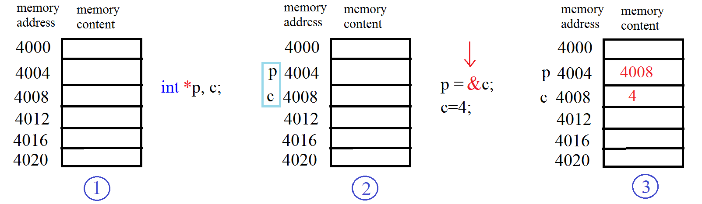
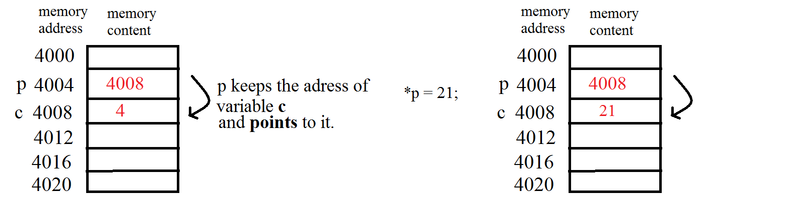
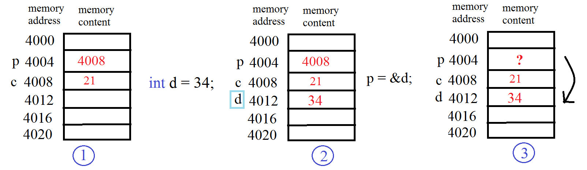

# Week 8

Call by reference
<pre><code>
void func(int *z){
    (*z)++;
    printf("In func: %d\n", *z);
}
int main()
{
    int a = 1;
    printf("%d\n", a);
    func(&a);
    printf("%d\n", a);
}
</code>
</pre>

Pointers

<bold>&</bold> address of operator

<bold>*</bold> value at address operator

## Question 1 (*)

Write a C program that declares and initializes (to any value you like) a
float, an int, and a char. Next declare and initialize a pointer to each of
the three variables. Your program should then print the address of, and value
stored in, and the memory size (in bytes) of each of the six variables.

Use the **"%p"** formatting specifier to print addresses in hexadecimal. You should see addresses that look something like this: "0xbfe55918". The initial
characters **"0x"** tell you that hexadecimal notation is being used; the remainder of the digits give the address itself. 

Use the **sizeof** operator to determine the memory size allocated for each variable (**"%lu"** for printing sizes). 

**Sample Output:**

*The addresses will be different when you run your program.*   

## Question 2

Write a function named **increment** which takes an integer as a parameter and increase the value of that integer and returns nothing. 

Write a function named **decrement** which takes an integer pointer (address of an integer) and decrease the value of the integer addressed by this pointer and returns nothing.

In the main program, read an integer from the user. Then call **increment** with this integer and print the value of this integer. Then call **decrement** with this integer and print the value of this integer again. Observe the difference and explain the reason. 

## Question 3 (TeachingCodes Lab8)

Write a function named **divideWithRemainder** which takes two integer values: **number** and **divisor**, and two integer pointers (addresses of two integers): **result** and **remainder**. This function should divide the number by divisor, then write the result into the address given by **result**, and 				write the remainder into the address given by **remainder**. 				 

In the main program, create four integers: a,b,c,d. Then read the values of a and b from the user. Then call the function with the values of a and b, and the addresses of c and d, respectively. Your function will divide a by b, and the value of c will be the result, and the value of d will be the remainder. Then print out the values of c and d. 				 

*Note that this function doesn't need to return anything, because it is already able to give output to the given addresses.* 				 

*Also note that, before calling a function with pointer inputs in the main program, you should first create appropriate variables so that you can give proper addresses to that function.* 		

## Question 4 (TeachingCodes Lab8)

Write a function named **swap** which takes two integer pointers (addresses of two integers) and swaps the values in those two addresses. 		

*Note that this function doesn't need to return a value.*

In the main program, create two integer variables a and b, then read their values from the user. Print their values to the screen. Then call the swap function with the addresses of these two integers, and print their 				values again to see if they are really swapped. 	

## Question 5 

Write a function named **local_max** which takes an integer **n** which is the number of integers to read and an integer pointer **ptr_to_greatest** to set the greatest local maximum in the sequence and returns number of local maxima of this sequence. If there is no local maximum in the sequence, then returns -1.

Consider three consecutive numbers such as **a**, **b**, **c**. **b** is a local maximum if it is higher than **a** and **c**. For example, in the sequence 7 4 8 5 6 1 10 3 there are two local maxima. 

| Subsequence | Local Max? | Greatest Local Max |
| ----------- | ---------- | ------------------ |
| 7 4 8       | -          | -                  |
| 4 8 5       | 8          | 8                  |
| 8 5 6       | -          | 8                  |
| 5 6 1       | 6          | 8                  |
| 6 1 10      | -          | 8                  |
| 1 10 3      | 10         | 10                 |

So, the function is supposed to set 10 to the addressed pointed by **ptr_to_greatest** and return 3. 	

| Input            | Return | *ptr_to_greatest   |
| ---------------- | ------ | ------------------ |
| 7 4 8 5 6 1 10 3 | 3      | 10                 |
| 1 3 5 7 9        | -1     | *Not set anything* |
| 8 6 11 7 4       | 1      | 11                 |
| 7 8 5 7 6 1 2    | 2      | 8                  |

## References

**\* ** http://www.csc.villanova.edu/~mdamian/Past/csc2400fa13/assign/plab.pdf

