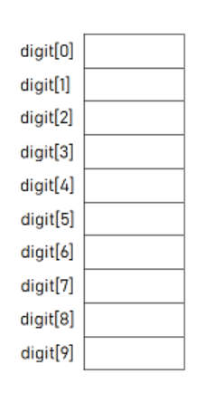
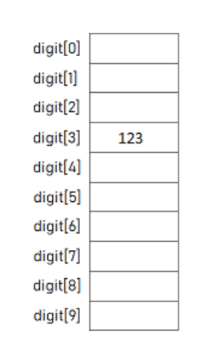
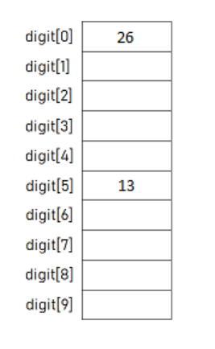
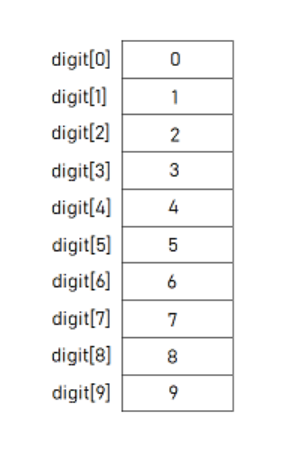
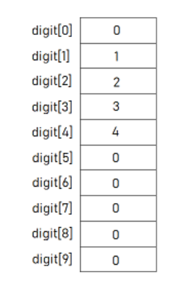
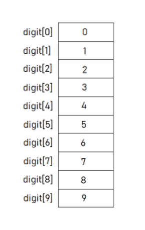
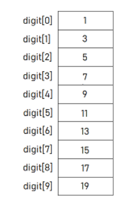

# Week 9 - Arrays

## Brief Summary


- An array is a group of memory locations.
- These locations are related by the fact that they have all the **same name** and **same type**.
- We can define an array as follows:
  - type arrName[size];
    - Where, **type** is any data type like **int**, **float** etc. 
    - **arrName** is the name of the array variable.
    - The square brackets contains an integer value **size**. It is the total number of values we can store in the array variable.
- In order to access to a particular location, i.e., an element within the array, we specify the name of the array and the position number (index) of the variable in square brackets.

  - arrName[3]
- Indices start from 0 and size -1

### Examples: 

- We want to create an array named **digit** of size **10** and type as **int**.

```c 
#include <stdio.h>

int main()
{
    int digit[10];

    return 0;
}
```

- The above code allocates memory space for 10 integer data values. Indices starts from 0. Also, be aware of that, these elements are not initialized, so that we don't know their values.




* We can assign values directly to each element of the array:

```c 
#include <stdio.h>

int main()
{
    int digit[10];

    digit[3] = 123;

    return 0;
}
```




------

- We can read values from the user and store them in the array:

```c 
#include <stdio.h>

int main()
{
    int digit[10];

    scanf("%d", &digit[5]); // Assume user enters 13
    digit[0] = digit[5] * 2;

    return 0;
}
```




<br>

------

- Now, let's initialize our digit array with digits from 0 to 9 to:

```c 
#include <stdio.h>

int main()
{
    int digit[10] = {0,1,2,3,4,5,6,7,8,9};
    


    return 0;
}
```



------

- What if we don't initialize all the elements of the array:

```c 
#include <stdio.h>

int main()
{
    int digit[10] = {0,1,2,3,4};

    return 0;
}
```

- Then the uninitialized elements will be automatically initialized to 0 (zero).



<br>

------

- Now, let's assign digits from 0 to 9 to the corresponding locations in our digit array with a loop:

```c 
#include <stdio.h>

int main()
{
    int i;
    int digit[10];

    for(i = 0; i < 10; i++)
        digit[i] = i;

    return 0;
}
```



<br>

------

- We can assign values to an array form the user with a for loop:

```c 
#include <stdio.h>

int main()
{
    int i;
    int digit[10];

    for(i = 0; i < 10; i++)
        scanf("%d", &digit[i]); // Assume the user enters 1 3 5 7 9 11 13 15 17 19

    return 0;
}
```




## Question 1 (Teaching Codes PS11)

**a**. Write a program that reads an integer N from the user, then reads N more integers from the user and store them in an array. Then prints the sum and average of the elements.

| Input                         | Output      |
| ----------------------------- | ----------- |
| 10 <br />1 2 3 4 5 6 7 8 9 10 | 55 5.500000 |
| 4<br />4 1 3 8                | 16 4.000000 |

**b**. Write a program that reads 10 elements from the user and store them in an array. Then prints elements larger than the average of numbers held in the array. 

| Input                          | Output     |
| ------------------------------ | ---------- |
| 10  <br />1 2 3 4 5 6 7 8 9 10 | 6 7 8 9 10 |
| 4 <br />4 1 3 8                | 8          |

## Question 2 (Teaching Codes Lab7)

Write a program which reads a sentence from the user (read characters until '\n' appears). Your program then should put this sentence into a char array (assume the sentence will be shorter than 50 characters).

Then, encrypt this sentence by adding +1 to the value of each character and print the encrypted version to the screen.

Then decrypt this sentence by adding -1 to each character, and print the decrypted version  to the screen.

| Input          | Output                            |
| -------------- | --------------------------------- |
| Hello Bogazici | Ifmmp!Cphb{jdj<br/>Hello Bogazici |
| Stay at home   | Tubz!bu!ipnf<br/>Stay at home     |

## Question 3 (Teaching Codes Lab7)

**a**. Write a program which reads an integer N from the user, then reads N integers from the user and store them in an array. Then print them to the screen in reverse order. Assume N is smaller than 50.

**b.** Write a program which reads an integer N from the user, then reads N integers from the user and store them in an array.  Then reverse the order of these integers in the array and print the array. 

| Input                 | Output         |
| --------------------- | -------------- |
| 5<br />3 1 -4 5 2     | 2 5 -4 1 3     |
| 6<br />15 7 2 89 8 12 | 12 8 89 2 7 15 |

<details><summary>Procedure</summary>
<p>Let's say we have a array with length 7. Indices 0, 1, 2, 3, 4, 5, 6 </p>
<p>We should swap the elements at index</p>
<p>    0, 6 </p>
<p>    1, 5</p>
<p>    2, 4</p>
<p>Pattern: i, size - i - 1    </p>
</details>

## Question 4 (Teaching Codes Lab7)

Write a program which reads two integers: N and M from the user. Then the program should read N more integers, then M more integers from the user. Assume N < M < 50.

If the first combination of N integers appears at least once in the second combination of M integers, the program should write the starting index of the first appearance in the second combination. Otherwise it should not print anything.

| Input                                          | Output |
| ---------------------------------------------- | ------ |
| 4 12<br/>4 5 6 5<br/>1 2 1 2 99 99 4 5 6 5 9 9 | 6      |
| 3 5<br/>2 2 2<br/>1 2 2 2 5                    | 1      |
| 3 5<br/>2 3 2<br/>1 2 2 2 5                    |        |

<details><summary>Procedure</summary>
<p>We must traverse the second array for the first array.  </p>
<p>Starting from each element of the second array, traverse the first array.  </p>
 <p>First array variable: i, Second array variable j </p>
 <p>j = 0, i = 0, 1, ..., N: compare i vs j+i: 0, 1, ..., N of second array </p>
 <p>j = 1, i = 0, 1, ..., N: compare i vs j+i: 1, ..., N+1 of second array   </p>
 <p>...   </p>  
 <p>j = M -N, i = 0, 1, ..., N: compare i vs j+i </p>
</details>

## Question 5 

Write a program which reads an integer N from the user, then reads N integers from the user to an array. Then find frequency of each element in the array. Assume N is smaller than 1000 and the entered numbers will be between 0 and 100 (inclusive).

| Input                         | Output                                     |
| ----------------------------- | ------------------------------------------ |
| 10<br/>5 10 2 5 50 5 10 1 2 2 | 1: 1<br/>2: 3<br/>5: 3<br/>10: 2<br/>50: 1 |

## Question 6

**a.** Write a program reads two integers N1, N2 from the user, then reads N1 and N2 integers from the user to create two arrays. Then print common (included in both arrays) elements and their indices in the first array. 

| Input                                          | Output                     |
| ---------------------------------------------- | -------------------------- |
| 6 8<br/>2 5 10 53 17 8<br/>-1 6 5 87 2 17 49 7 | 2 0<br/>5 1<br/>17 4<br /> |

**b.** Update or rewrite your program so that if the common element is included twice or more in the second array, print the common element and its index in the first array once. 

| Input                                           | Output               |
| ----------------------------------------------- | -------------------- |
| 6 8<br/>2 5 10 53 17 8<br/>-1 6 5 87 2 17 49 17 | 2 0<br/>5 1<br/>17 4 |

## Question 7

Write a program which reads an integer N from the user, then reads N integers from the user to an array. Then modify the array so that it contains exactly the same numbers as the given array, but rearranged so that every 3 is immediately followed by a 4. Do not move the 3's, but every other number may move. The array contains the same number of 3's and 4's, every 3 has number after it that is not a 3, and a 3 appears in the array before any 4.

| Input                 | Output        |
| --------------------- | ------------- |
| 4 <br />1 3 1 4       | 1 3 4 1       |
| 7 <br />1 3 1 4 4 3 1 | 1 3 4 1 1 3 4 |
| 4<br />3 2 2 4        | 3 4 2 2       |

