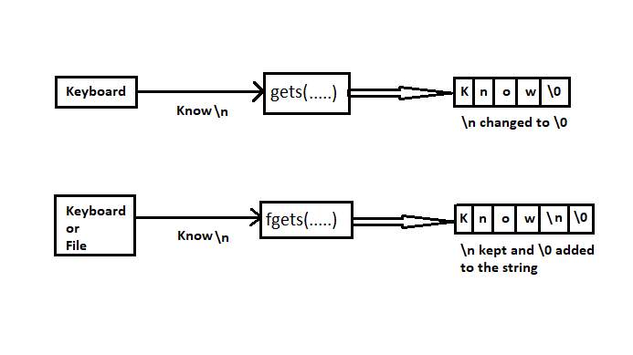
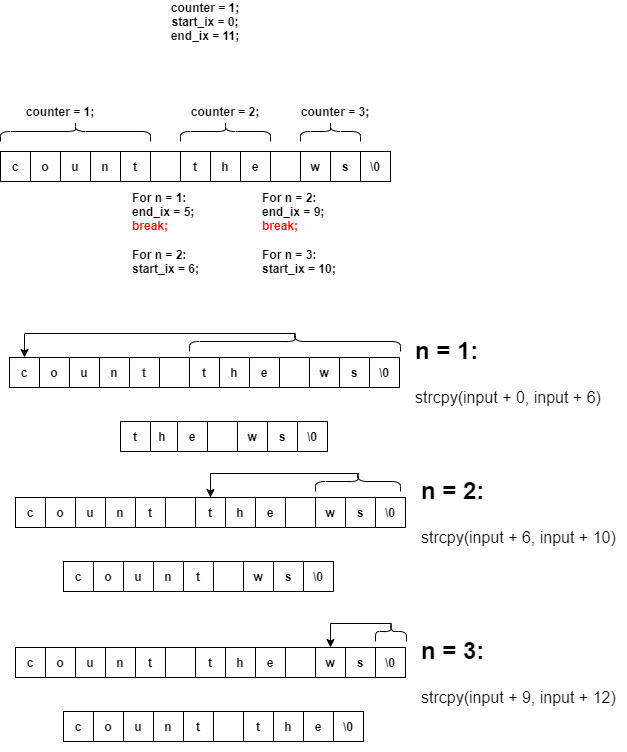
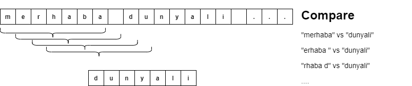

# Cmpe150 Week11

## Strings

* character array. `char str[101];`
* ends with the null character ('\0').
* `char str[] = "Hello";` = `char str[] = {'H', 'e', 'l', 'l', 'o', '\0'};`

**Single quotes for characters, double quotes for strings!**

* Initialization
  * `char c[] = "abcd";`
  * `char c[50] = "abcd";`
  * `char c[] = {'a', 'b', 'c', 'd', '\0'};`
  * `char c[5] = {'a', 'b', 'c', 'd', '\0'};`

* No need to track size of it. 

  * ```c
    char str[] = "Hello World!";
    for(int i=0; str[i] != '\0'; i++)
    	printf("%c-", str[i]);
    ```

* Arrays and strings do not support the assignment operator once it is declared:

  * ```c
    char c[100];
    c = "C programming";  // Error! array type is not assignable.
    strcpy(c, "C programming") // Correct!
    ```

### Output

* `printf("%s\n", str);`  =  `puts(str);`

### Input

* `char str[101];`

* `scanf("%s", str); // Reads until space`

* `gets(str); // Reads until enter`

* **Safer**: `fgets(str, 21, stdin);`

* ```c
  #include <stdio.h>
  int main(){
     char str[100];
     printf("Enter a string: ");
     scanf("%s", str); 
     //gets(str);  
     //fgets(str, sizeof(str), stdin); 
     printf("The entered string: %s", str);
     return 0;
  }
  ```

* The **gets()** and **fgets()** do not work the same. The **gets()** function converts **newline character** to the **end-of-string character (‘\0’)** but **fgets() don’t convert newline character**, it puts a newline character in the string and appends an end-of-string character (‘\0’).

  


### Passing strings to functions

* Same as arrays: pass by reference.
* No need to pass the size. 

### Array - Pointer Relation

```c
int main(){
    int myArr[5] = {1, 5, 6, 2, 2};
    int i;
    
    for(i = 0; i < 5; i++)
        printf("%d ", *(myArr+i)); // Output: 1 5 6 2 2

    return 0;
}
```

### Built-in string library

* #include <string.h>
* strlen(): Length of a string
  
  * The size of a string, not counting the terminating zero '\0'.
* strcpy() and strncpy(): Copy strings
  * `char *strcpy(char *s1, const char *s2); `
  
  * `char *strncpy(char *s1, const char *s2, size_t n)`
  
  * The destination should be large enough!
  
  * `strcpy()` copies and pastes null (`\0`) character. But `strncpy()` does not automatically puts a null (`\0`) character at the end of the pasted part. 
  
  * ```c
    #include <stdio.h>
    #include <stdlib.h>
    #include <string.h>
    int main(){
    	int i;
    	char s1[100] = "01234 56789", s2[100] = "abc defg", s3[100];
    	char s4[] = "12345678";
    
    	strcpy(s1, s2);
        strcpy(s3, s1+4);
        strncpy(s4, s1+4, 2);
    	printf("s1: %s\n", s1);
    	printf("s2: %s\n", s2);
    	printf("s3: %s\n", s3);
    	printf("s4: %s\n", s4);
    
    	return 0;
    }
    ```
  
* strcmp() and strncmp(): Compare strings
  * `int strcmp(const char *s1, const char *s2);`
    * Returns < 0 if s1 comes before s2 alphabetically.
    *  Returns 0 if s1 is identical to s2 alphabetically.
    * Returns > 0 if s1 comes after s2 alphabetically.
    
  * `int strncmp(const char *s1, const char *s2, size_t n);`
  
  * ```c
    int main(){
        char s1[100] = "a1234", s2[100] = "b11234";
    
        printf("%d\n", strcmp(s1, s2)); // -1 -> ('a' - 'b')
        printf("%d\n", strcmp(s1+1, s2+2)); // 0 -> Same
    
        return 0;
    }
    
    ```
* strcat(), strncat(): Append a string to the end of another
  * `char *strcat(char *s1, const char *s2);`
  
  * `char *strncat(char *s1, const char *s2, size_t n);`
  
  * ```c
    int main(){
        char s1[100] = "01234 56789", s2[100] = "abc defg";
    
        strcat(s1, s2);
    
        printf("s1: %s\n", s1); // s1: 01234 56789abc defg
        printf("s2: %s\n", s2); // s2: abc defg
    
        return 0;
    }
    ```

### Question 1

Write a function that copies a source string to the destination string. You can assume that (you should ensure that) destination string is large enough.

*Try using `strcpy` function from `string.h` library.*

### Question 2

Write a function that takes two strings as argument and compares them. The function should perform what `strcmp` function from `string.h` library. Validate your function by using `strcmp` along with your function.

```
input: abz abc 
output: 23
```

### Question 3

Write a program to count the total number of words in a string.

```
input: count the total number of words in a string
output: 9
```

### Question 4

**a.** Write a program which takes a string and an integer n as parameters and print the nth word in the string. 

```
input: count the total number of words in a string 3
output: total
```

**b. **Write a program which takes a string and an integer n as parameters and deletes the nth word in the string. 

```
input: count the total number of words in a string. 3
output: count the number of words in a string.
```

<details><summary>Figure</summary></details>
### Question 5

**a.** Write a program to find maximum occurring character in a string assume all characters in lowercase.

```
input: she borrowed the book
output: o
```

**b.** Update your program so that it would work with all characters not only lowercase ones.

*Hint: What's the size of ASCII table?*

### Question 6

Write a program which reads a sentence as a string, and a word as a string. Then the program should exclude this word from the sentence if the sentence contains the word, then print the new version to the screen. Assume no punctuation will occur, and every letter is lower case.

```
input: merhaba dunyali nasilsin dunyali
output: merhaba nasilsin
```



### Question 7

Write a program which takes a string as parameter and sorts words of this string and prints the resulting string. Assume initial string has maximum 100 characters and the length of each word is at most 10. 

```
input: the lake is a long way from here
output: a from here is lake long the way
```

<details><summary>Words</summary></details>