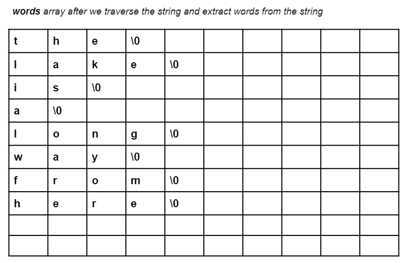

# Solutions

## Question 1

```c
/*
 ============================================================================
 Name        : w11_q1.c
 Author      : 
 Version     :
 Copyright   : Your copyright notice
 Description : Hello World in C, Ansi-style
 ============================================================================
 */

#include <stdio.h>
#include <stdlib.h>
#include <string.h>

void copy_string(char src[], char dest[]){
	int i;
	for(i = 0; src[i] != '\0'; i++){
		dest[i] = src[i];
	}
	dest[i] = '\0';
}
int main() {
	char src[101];
	char dest1[101];
	char dest2[101];
	fgets(src, sizeof(src), stdin);
	copy_string(src, dest1);
	printf("%s", dest1);
	strcpy(dest2, src);
	printf("%s", dest2);
	return 0;
}
```

## Question 2 

```c

#include <stdio.h>
#include <string.h>

int compare_strings(char s1[], char s2[]){
	int i;
	for(i = 0 ; s1[i] != '\0' && s2[i] != '\0'; i++)
		if(s1[i] != s2[i])
			return s1[i] - s2[i];
	return 0;
}

int main(){
	char s1[100], s2[100];
	fgets(s1, sizeof(s1), stdin);
	fgets(s2, sizeof(s2), stdin);

    printf("%d\n", compare_strings(s1, s2));
    printf("%d\n", strcmp(s1, s2));
	return 0;
}
```

## Question 3

```c
#include <stdio.h>
#include <stdlib.h>

int main() {
	char input[101];
	fgets(input, 101, stdin);
	int i, counter=1;
	for(i=0; input[i] != '\0'; i++){
		if(input[i] == ' '){
			counter++;
		}
	}
    printf("%d", counter);
	return 0;
}
```

## Question 4

### a.

```c
#include <stdio.h>
#include <stdlib.h>

int main() {
	char input[101], nth_word[101];
	int n;
	fgets(input, 101, stdin);
	scanf("%d", &n);
	int i, counter=1, word_ix=0;
	for(i=0; input[i] != '\0'; i++){
		if(counter == n){
			//printf("%c", input[i]);
           	nth_word[word_ix] = input[i];
            word_ix++;
		}
		if(input[i] == ' '){
			counter++;
		}
	}
    nth_word[word_ix] = '\0';
    printf("%s", nth_word);
	return 0;
}
```

### b.

```c
#include <stdio.h>
#include <stdlib.h>

int main() {
	char input[101];
	int n;
	fgets(input, 100, stdin);
	scanf("%d", &n);
	int i, counter=1;
    int start_ix = 0; // beginning of the first word
	int end_ix = strlen(s1)-1; // end of the last word
	for(i=0; input[i] != '\0'; i++){
		if(input[i] == ' '){
			counter++;
            if(counter == n){
				start_ix = i + 1; // the start index of nth word
			}
			if(counter == n+1){
				end_ix = i; // the index of the space after the nth word
				break;
			}
		}
	}
	if(strlen(s1)-1 == end_ix){
		start_ix -= 1; // for the last space before the last word
	}
	for(i = start_ix; input[i] != '\0'; i++){
		input[i] = input[i + end_ix - start_ix];
	}
	input[i+1] = '\0';
	printf("%s", input);
	return 0;
}
```

### Alternative

```c
#include <stdio.h>
#include <stdlib.h>
#include <string.h>
void delete_nth_word(char s1[], int n){
	int i, counter=1;
	int start_ix = 0; // beginning of the first word
	int end_ix = strlen(s1)-1; // end of the last word
	for(i=0; s1[i] != '\0'; i++){
		if(s1[i] == ' '){
            counter++;
            if(counter == n){
				start_ix = i + 1; // the start index of nth word
			}
			if(counter == n+1){
				end_ix = i; // the index of the space after the nth word
				break;
			}
		}
	}
    if(strlen(s1)-1 == end_ix){
		start_ix -= 1; // for the last space before the last word
	}
	strcpy(s1+start_ix, s1+end_ix+1);
}

int main() {
	char input[101];
	int n;
	fgets(input, 100, stdin);
	scanf("%d", &n);
	delete_nth_word(input, n);
	printf("%s", input);
	return 0;
}

```

## Question 5

### a.

```c
#include <stdio.h>
#include <stdlib.h>

int main() {
	char str[101];
	int n, i;
	fgets(str, 101, stdin);
	int freq[26] = {0};
	for(i=0; str[i] != '\0'; i++){
		freq[str[i] - 'a']++;
	}
	int max=0;
	char max_char;
	for(i=0; i<26; i++){
		if(freq[i] > max){
			max = freq[i];
			max_char = i + 'a';
		}
	}
	printf("%c", max_char);
	return 0;
}
```

### b.

```c
#include <stdio.h>
#include <stdlib.h>

int main() {
	char str[101];
	int n, i;
	fgets(str, 101, stdin);
	int freq[256] = {0};
	for(i=0; str[i] != '\0'; i++){
		freq[str[i]]++;
	}
	int max=0;
	char max_char;
	for(i=0; i<256; i++){
		if(freq[i] > max){
			max = freq[i];
			max_char = i;
		}
	}
	printf("%c", max_char);
	return 0;
}
```

### Question 6

```c

#include <stdio.h>
#include <string.h>

int main(){
	int i;
	char s1[100], s2[100];
	fgets(s1, 100, stdin);
	fgets(s2, 100, stdin);

	s1[strlen(s1) - 2] = '\0';
	s2[strlen(s2) - 2] = '\0';

	for(i = 0 ; i < strlen(s1) ; i++){
		if(strncmp(s1+i, s2, strlen(s2)) == 0){
			char temp[100];
			strcpy(temp, s1+i+strlen(s2)+1);
			strcpy(s1+i, temp);
			break;
		}
	}

	puts(s1);

	return 0;
}
```

### Question 7



```c

#include <stdio.h>
#include <string.h>

int main(){
	char str[101];
	fgets(str, 101, stdin);
	int length = strlen(str);
	str[length - 2] = '\0';
	int i, j;
	int num_of_words = 0;
	char words[10][10];
	int word_index = 0;
	for(i=0; str[i] != '\0'; i++){
		if(str[i] == ' '){
			words[num_of_words][word_index] = '\0';
			num_of_words++;
			word_index = 0;
		}else{
			words[num_of_words][word_index] = str[i];
			word_index++;
		}
	}
	words[num_of_words][word_index] = '\0';

	// Prints words to make sure we are able to split it to words.
	/*for(i = 0; i <= num_of_words; i++){
		for(j = 0; words[i][j] != '\0'; j++){
			printf("%c", words[i][j]);
		}
		printf("\n");
		// puts(words[i]); // equivalent to for loop and print newline above. 
	}*/


	char temp[10];
    // Bubble sort words of the sentence. 
	for(i = 0; i <= num_of_words; i++){
		for(j = i+1; j <= num_of_words; j++){
			if(strcmp(words[i], words[j]) > 0){
				strcpy(temp, words[i]);
				strcpy(words[i], words[j]);
				strcpy(words[j], temp);
			}
		}
	}

	for(i = 0; i <= num_of_words; i++){
		for(j = 0; words[i][j] != '\0'; j++){
			printf("%c", words[i][j]);
		}
		printf(" ");
	}

	return 0;
}

```
