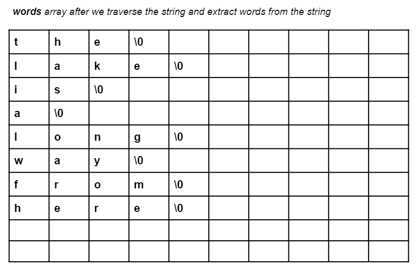

# Solutions

## Warm up

```c
#include <stdio.h>
#include <stdlib.h>

void read_2d_array(int size1, int size2, int arr[size1][size2]){
	int i, j;
	for(i=0; i<size1; i++){
		for(j=0; j<size2; j++){
			scanf("%d", &arr[i][j]);
		}
	}
}
int main(void) {
	int size1, size2;
	int k;
	scanf("%d %d", &size1, &size2);
	scanf("%d", &k);

	int numbers[size1][size2];
	read_2d_array(size1, size2, numbers);

	int i, j;
	for(i=0; i<size1; i++){
		int sum = 0;
		int min = size2 < k*(i+1) ? size2 : k*(i+1);
		for(j=0; j < min; j++){
			printf("%d ", numbers[i][j]);
			sum += numbers[i][j];
		}
		printf("%d\n", sum);
	}
	return EXIT_SUCCESS;
}
```

### Alternative

```c
#include <stdio.h>
#include <stdlib.h>

int main(void) {
	int a, b, k, i, j, sum=0;
	scanf("%d %d %d", &a, &b, &k);
	int array[a][b];
	for(i=0; i<a; i++)
		for(j=0; j<b; j++)
			scanf("%d", &array[i][j]);
	
	for(i=0; i<a; i++){
		for(j=0; j<((i+1)*k) && j<b;j++){
			printf("%d ",array[i][j]);
			sum+=array[i][j];
		}
		printf("%d\n",sum);
		sum=0;
	}

	return EXIT_SUCCESS;
}
```

## Question 1

```c
#include <stdio.h>
#include <stdlib.h>

int main(void) {
	char input[101];
	int n;
	fgets(input, 100, stdin);
	int i, counter=1;
	for(i=0; input[i] != '\0'; i++){
		if(input[i] == ' '){
			counter++;
		}
	}
    printf("%d", counter);
	return EXIT_SUCCESS;
}
```

## Question 2

```c
#include <stdio.h>
#include <stdlib.h>

int main(void) {
	char input[101];
	int n;
	fgets(input, 100, stdin);
	scanf("%d", &n);
	int i, counter=1;
	for(i=0; input[i] != '\0'; i++){
		if(counter == n){
			printf("%c", input[i]);
		}
		if(input[i] == ' '){
			counter++;
		}
	}
	return EXIT_SUCCESS;
}

```

### Homework

```c
#include <stdio.h>
#include <stdlib.h>

int main(void) {
	char input[101];
	int n;
	fgets(input, 100, stdin);
	scanf("%d", &n);
	int i, counter=1, start_ix, end_ix, str_len=0;
	for(i=0; input[i] != '\0'; i++){
		if(input[i] == ' '){
			counter++;
			if(counter == n){
				start_ix = i;
			}else if(counter == n+1){
				end_ix = i;
			}
		}
		str_len++;
	}

	for(i = start_ix; input[i] != '\0'; i++){
		input[i] = input[i + end_ix - start_ix];
	}
	input[i+1] = '\0';
	printf("%s", input);
	return EXIT_SUCCESS;
}
```

## Question 3

```c
#include <stdio.h>
#include <stdlib.h>

int main(void) {
	char str[101];
	int n, i;
	fgets(str, 101, stdin);
	int freq[26] = {0};
	for(i=0; str[i] != '\0'; i++){
		freq[str[i] - 'a']++;
	}
	int max=0;
	char max_char;
	for(i=0; i<26; i++){
		if(freq[i] > max){
			max = freq[i];
			max_char = i + 'a';
		}
	}
	printf("%c", max_char);
	return EXIT_SUCCESS;
}
```

### Homework

```c
#include <stdio.h>
#include <stdlib.h>

int main(void) {
	char str[101];
	int n, i;
	fgets(str, 101, stdin);
	int freq[256] = {0};
	for(i=0; str[i] != '\0'; i++){
		freq[str[i]]++;
	}
	int max=0;
	char max_char;
	for(i=0; i<256; i++){
		if(freq[i] > max){
			max = freq[i];
			max_char = i;
		}
	}
	printf("%c", max_char);
	return EXIT_SUCCESS;
}
```

## Homework



```c
#include <stdio.h>
#include <string.h>

int main(void){
	char str[101];
	fgets(str, 100, stdin);
	int length = strlen(str);
	str[length - 2] = '\0';
	int i, j;
	int num_of_words = 0;
	char words[10][10];
	int word_index = 0;
	for(i=0; str[i] != '\0'; i++){
		if(str[i] == ' '){
			words[num_of_words][word_index] = '\0';
			num_of_words++;
			word_index = 0;
		}else{
			words[num_of_words][word_index] = str[i];
			word_index++;
		}
	}
	words[num_of_words][word_index] = '\0';

	// Prints words to make sure we are able to split it to words.
	/*for(i = 0; i <= num_of_words; i++){
		for(j = 0; words[i][j] != '\0'; j++){
			printf("%c", words[i][j]);
		}
		printf("\n");
	}*/


	char temp[10];
	for(i = 0; i <= num_of_words; i++){
		for(j = i+1; j <= num_of_words; j++){
			if(strcmp(words[i], words[j]) > 0){
				strcpy(temp, words[i]);
				strcpy(words[i], words[j]);
				strcpy(words[j], temp);
			}
		}
	}

	for(i = 0; i <= num_of_words; i++){
		for(j = 0; words[i][j] != '\0'; j++){
			printf("%c", words[i][j]);
		}
		printf(" ");
	}

	return 0;
}
```

## Question 4

```c
#include <stdio.h>
#include <stdlib.h>

int main(void) {

	char first_string[101], second_string[10];
	int len_str1 = 0;
	int len_str2 = 0;
	fgets(first_string, 100, stdin);
	fgets(second_string, 10, stdin);
	first_string[strlen(first_string) - 2] = '\0';
    second_string[strlen(second_string) - 2] = '\0';

	while(first_string[len_str1] != '\0'){
		len_str1++;
	}

	while(second_string[len_str2] != '\0'){
		len_str2++;
	}

	int i, j, is_present, start_ix=-1;
	for (i = 0; i <= len_str1 - len_str2; i++){
		for (j = i; j < i + len_str2; j++){
			is_present = 1;
			if (first_string[j] != second_string[j - i]){
				is_present = 0;
				break;
			}
		}
		if (is_present == 1){
			start_ix = i;
			break;
		}
	}

	printf("%d", start_ix);
	return EXIT_SUCCESS;
}
```

## Homework

```c
#include <stdio.h>

void trim(char str[]){
    int index, i;
    index = 0;
    /*
     * Count the number of leading spaces
     */
    while(str[index] == ' ' || str[index] == '\t' || str[index] == '\n'){
        index++;
    }

    i = 0;
    while(str[i + index] != '\0'){
        str[i] = str[i + index]; // shift characters to write over leading spaces
        i++;
    }

    str[i] = '\0'; // Terminate string with NULL

    i = 0;
    index = -1;
    while(str[i] != '\0'){
        if(str[i] != ' ' && str[i] != '\t' && str[i] != '\n'){
            index = i; // count the number of non-whitespace characters.
        }
        i++;
    }

    str[index + 1] = '\0';
}

int main(void){
    char str[101];
    fgets(str, 100, stdin);
    trim(str);
    printf("%s", str);
    return 0;
}

```