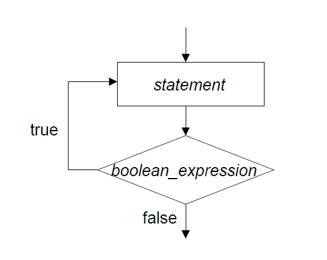

# Cmpe150.03 Week 5

### ternary if else

```
num1 > num2 ? 1 : 0 
```

### Switch case

- When a matching case is found, the program will execute all the cases below it as well.

- Use the break command to end the switch statement and skip remaining cases.

  ```c
  char command = 'b';
  switch(command)
  {
      case 'a':
      case 'A': printf("Plan A\n");
      break;
      case 'b':
      case 'B': printf("Plan B\n");
      break;
      default : printf("I have no plans.\n"); // optional
  }
  ```

  

##### What if we forget *break*?

### Question 1

Write a program that takes a number in range (1, 7) and prints corresponding day of week using switch case

```
input: 3
output: wednesday
```

### Question 2

Write a C program to input two numbers from user and find maximum between two numbers using switch case.

```
input: 40 30
output: 40
```

## Loops

**While, do/while, for**

### while loops

* controlled by a boolean expression like if

* determines how many times statement in code block will execute

* Repeat until the expression becomes **false**.

  ```
  while (<boolean_expression>)
  	<statement>
  ```

  

  

  * Loop control variable *i*
  
    ```c
    int i = 0; // initialize
    while (i < n) { // test
    	printf("*"); 
    	i++; //update
    }
    ```
  
How can we end up in an infinite loop?
  
#### Question 3
  
  ##### a.
  
  Write a program that takes an integer as input and computes the sum of positive integers up to that integer using while loops. 
  
```
input: 3
output: 6

input: 5
output: 15
```
  
  ##### b.
  
  Write a program that takes an integer as input and computes the sum of positive odd integers up to that integer using while loops. 
  
```
input: 3
output: 4

input: 5
output: 9
```
  
  #### Question 4
  
  Write a program which reads an integer (smaller than 1000000) then prints out how many of the digits are odd numbers.
  
``` 
input: 16283 
output: 2

input: 15672
output 3
```
  
  ## do-while loops
  
  First statement is executed, then expression is evaluated. 
  
```c
do
	<statement>
while (<boolean_expression>);
```
  

  

  
  
  
  #### Question 5
  
  Write a program that take integers as inputs until the user enters negative number and show the maximum number entered by user.
  
````
input: 8 3 0 105 18
output: 105
  
input: 75 7 1 5 39 45 67
output: 75
````

  #### pre/post increment/decrement operators: a++, ++a, a--, --a

  * Pre increment/decrement: first increases/decreases value, then use it
  * Post increment/decrement: first uses the value, then increases/decreases
  
  ## References
  
https://www.cs.cmu.edu/~mrmiller/15-110/
